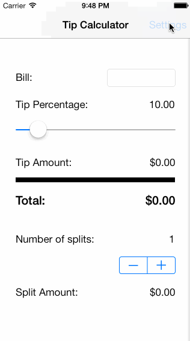

tipster
=======

Tip Calculator App

The app allows user to calculate tip for a bill, and additionally allows displaying split amounts for splitting the bill among friends.

Time Spent: 7 Hours
Completed user stories:

 * [x] Required: Created Settings Page
 * [x] Required: Added option to save defaults using NSDefaults
 * [x] Required: Added option to save defaults using NSDefaults
 * [x] Required: Utilized view controller lifecycle to load and save values between view switches

Experimented and used a Slider and a Stepper.

GIF created with [LiceCap](http://www.cockos.com/licecap/).
